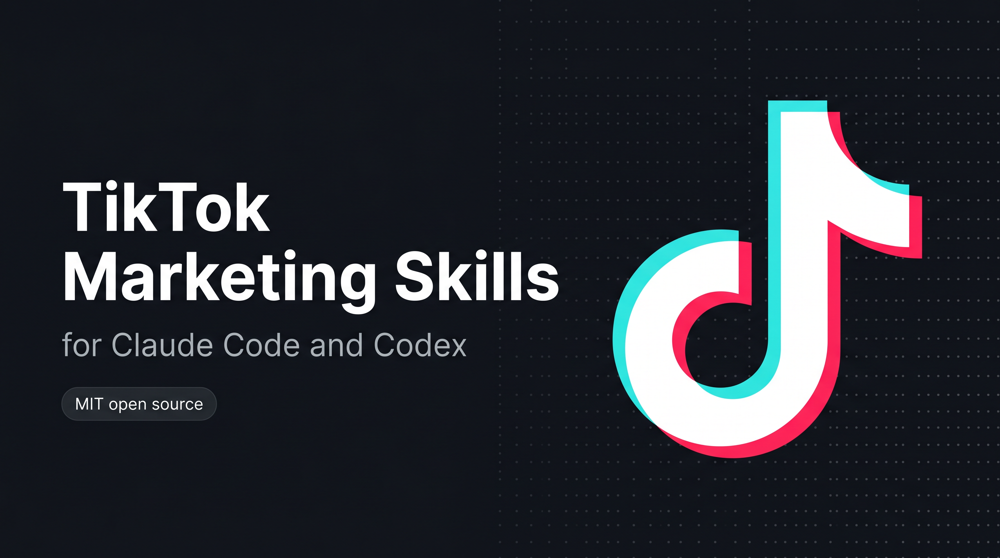

<p align="center">
  
</p>

# TikTok Marketing Skills for Claude Code and Codex

<p align="center">
  
  
  
  
  
  
  
</p>

6 skills that help Claude Code and Codex script hooks, write captions, ride trends, repurpose content, and plan a week of TikTok video in your voice. They draft the script and caption, strip AI tells so it sounds human on camera, and wait for your approval before anything gets scheduled. You supply the video. No coding required.

## TikTok is video-only

TikTok does not accept text-only posts. These skills do not generate video. They produce everything around it: the spoken hook script, the on-screen text, the caption, the hashtags, and the posting settings. You record and render the clip; the skills handle the words and the publish.

## Install

Pick whichever way you use Claude Code or Codex:

### Codex CLI

```bash
codex plugin marketplace add sergebulaev/tiktok-skills
codex plugin add tiktok-skills@tiktok-skills
```

To test a local clone before publishing changes:

```bash
git clone https://github.com/sergebulaev/tiktok-skills.git
cd tiktok-skills
codex plugin marketplace add .
codex plugin add tiktok-skills@tiktok-skills
```

### claude.ai (web)

1. Open https://claude.ai/code
2. Go to **Skills** in the sidebar
3. Click **Add from GitHub**
4. Paste: `sergebulaev/tiktok-skills`
5. Done. The skills activate automatically when you ask about TikTok.

### Claude Desktop (Mac / Windows)

1. Open Claude Desktop
2. Open **Settings** (gear icon)
3. Go to **Skills**
4. Click **Add from GitHub**
5. Paste: `sergebulaev/tiktok-skills`
6. Done. Start a new conversation and ask Claude to script a hook.

### Claude Code (CLI / VS Code / JetBrains)

```
/plugin marketplace add sergebulaev/tiktok-skills
/plugin install tiktok-skills@tiktok-skills
```

Or clone the repo and open it as your working directory:

```bash
git clone https://github.com/sergebulaev/tiktok-skills.git
cd tiktok-skills
```

### OpenClaw

1. Open your OpenClaw working directory
2. Clone the skills into it:
   ```bash
   git clone https://github.com/sergebulaev/tiktok-skills.git
   ```
3. In OpenClaw settings, add this to your system prompt:
   ```
   You have TikTok marketing skills in ./tiktok-skills/.
   For any TikTok task, read the relevant skills/*/SKILL.md first.
   Use lib/url_parser.py for URL parsing and lib/publora_client.py for publishing.
   ```
4. Done. Ask OpenClaw to write a TikTok post.

### Hermes Agent

Hermes Agent (Nous Research) follows the agentskills.io open standard and loads `skills/*/SKILL.md` directly. Clone the bundle into your Hermes skills folder:

```bash
git clone https://github.com/sergebulaev/tiktok-skills.git ~/.hermes/skills/tiktok-skills
```

Coming from OpenClaw? `hermes claw migrate` imports these skills automatically. Then call `/<skill-name>` from any of your Hermes chat surfaces.

### Any agent (skills CLI)

One command that works across Claude Code, Codex, Cursor, and any other agent that reads SKILL.md files:

```bash
npx skills add sergebulaev/tiktok-skills
```

## What you can do

Once installed, just ask Claude Code or Codex for help with TikTok. The right skill activates automatically.

**Script a hook:**
> "Script a 3-second hook for a video about the git command that saved my job. Goal: saves."

**Write the caption and settings:**
> "Write the caption, hashtags, and TikTok settings for this video. Comments on, public."

**Ride a trend without being cringe:**
> "Should I jump on this trending sound for my backend dev niche? [link]. How do I make it mine?"

**Make a script sound human on camera:**
> "Strip the AI tells from this script so it sounds like me talking, not a teleprompter: [paste]"

**Plan your week:**
> "Plan a week of TikTok content. I teach backend engineering to junior devs."

Every skill shows you a draft first and waits for your OK. Nothing gets scheduled without your approval.

## The 6 skills

| Skill | What it does |
|---|---|
| **Hook Scripter** | Scripts the first 1-3 seconds of the video: the spoken line, the on-screen text, and the opening visual, all firing at once. Picks a 2026 hook formula by goal (completion, saves, comments, shares). The single biggest retention lever |
| **Caption Writer** | Writes the caption under 2,200 chars, picks a 3 to 5 hashtag set with mixed reach, and sets the `platformSettings.tiktok` flags (viewer setting, comments, duet, stitch, commercial and branded content). Publishes the rendered video via Publora on approval |
| **Trend Mapper** | Maps a trending sound or format to your niche so the ride is authentic, not cringe. Runs a fit check, reads the trend lifecycle, scripts the twist that makes it yours, and tells you when to skip a trend entirely |
| **Humanizer** | Strips AI-script tells so the spoken words sound human on camera. Kills em dashes, AI vocabulary, "hey guys" filler, and teleprompter rhythm. Bundles a `--mode audit` pre-film check (hook strength, completion design, caption fit) |
| **Content Planner** | Builds a weekly plan with per-day hooks, sounds, lengths, and goals, a hook-batching schedule so you film several openers in one session, a sound shortlist with the trend window, and a completion-rate goal check |
| **Repurposer** | Rebuilds content from another platform (LinkedIn post, blog, newsletter, X thread) into a native TikTok script and caption: opens on the payoff, rewrites every line to be sayable in one breath, adds a trend or sound angle where it fits, and strips off-platform artifacts before publishing on approval |

## How publishing works on TikTok

TikTok requires a video on every post, so a caption alone cannot go out. The official TikTok Content Posting API also needs an OAuth flow and an app review. This bundle hands the whole chain to [Publora](https://publora.com): once you have a rendered .mp4, the flow is

```
1. create a draft (the caption, no scheduled time)
2. get a pre-signed upload URL
3. upload the video
4. set the scheduled time
```

`lib.publish("video", caption, target_url, video_path=..., scheduled_time=...)` runs all four steps in one call. The Caption Writer skill uses this on approval.

## Optional: schedule videos with Publora

By default, the skills draft the script, caption, and settings for you to upload in the TikTok app. If you want Claude Code or Codex to schedule a rendered video directly, connect Publora. It takes about 2 minutes once you have the .mp4.

### What is Publora?

[Publora](https://publora.com) is a publishing API that turns the multi-step TikTok video upload into one `create-post`-plus-upload call (and can cross-post the same content to other platforms).

### Setup (2 minutes)

**Step 1.** Sign up at https://app.publora.com/signup (free)

**Step 2.** Connect TikTok: click **Channels** in the left sidebar, then **Add Channel**, pick **TikTok**, authorize.

**Step 3.** Find your Platform ID: go to **Channels**, click your TikTok account. The ID looks like `tiktok-7123456789`. Copy the whole thing including `tiktok-`.

**Step 4.** Get your API key: click **Settings** (gear icon, bottom-left), then **API**, then **Create Key**. Copy the `sk_...` string.

**Step 5.** Create a file called `.env` in the tiktok-skills folder:

```
PUBLORA_API_KEY=sk_paste_your_key_here
TIKTOK_PLATFORM_ID=tiktok-paste_your_id_here
```

If you cloned the repo, copy the template instead:

```bash
cp .env.example .env
```

Then open `.env` and replace the placeholders with your real values.

**Step 6.** Install two small Python packages:

```bash
pip install requests python-dotenv
```

**Step 7.** Test it. Ask Claude Code or Codex:

> "Schedule a private (SELF_ONLY) test video via Publora using this file: ./test.mp4, 24 hours from now."

If Publora returns a `postGroupId`, you're set. Use `SELF_ONLY` so nobody sees the test, and cancel it in the dashboard. If you get HTTP 401, your API key is wrong. If you get an `Invalid platform ID format` error, your `TIKTOK_PLATFORM_ID` is wrong. See [Troubleshooting](#troubleshooting).

> **Two TikTok quirks to know:**
> - **Boolean inversion bug.** Publora may map `allowComments` / `allowDuet` / `allowStitch` to TikTok's `disable_*` flags, so they can land inverted. Test with a `SELF_ONLY` draft before trusting them.
> - **Unaudited apps post PRIVATE only.** Until the publishing app passes TikTok's review, every post is forced to `SELF_ONLY` regardless of your viewer setting.

## Voice rules

Every skill follows these rules automatically:

1. No em dashes. Biggest AI tell in 2026, and on screen it reads as a typo.
2. Write the script the way a person talks: contractions, fragments, short lines. Read it out loud.
3. Capitalize names. Always. Lowercase a brand reads as careless.
4. No AI vocabulary: "leverage", "fundamentally", "delve", "harness". And no "hey guys" / "don't forget to subscribe".
5. Specific numbers beat adjectives. "3 takes" beats "a few takes".
6. The hook is the first 1-3 seconds of the video, not the caption. Spoken line and on-screen text differ.
7. Caption <= 2,200 chars (API). 3 to 5 mixed-reach hashtags at the end.

## Troubleshooting

| Problem | Fix |
|---|---|
| Skills don't activate when I ask about TikTok | Make sure you installed via the Skills panel, `/plugin install`, or `codex plugin add`. Try a new conversation. |
| "PUBLORA_API_KEY not set" | Your `.env` file is missing or in the wrong folder. It should be in the `tiktok-skills/` root. |
| "401 Invalid API key" from Publora | Your API key is wrong or revoked. Go to Publora Settings > API > Create a new key. |
| "Invalid platform ID format" | Your `TIKTOK_PLATFORM_ID` is wrong. Go to Publora Channels and copy the full `tiktok-...` string. |
| My "public" post went out private | Unaudited apps can only post `SELF_ONLY`. The publishing app needs to pass TikTok's review for public posting. |
| Duets are off when I asked for on | The known boolean inversion bug. Test with a `SELF_ONLY` draft, then send the opposite value as a workaround. |
| My video got rejected | Check duration (3s to 10min on the API), format (MP4 / MOV / WebM), and frame rate (min 23 FPS). |
| `pip install` fails | Use a virtual environment: `python -m venv venv && source venv/bin/activate && pip install requests python-dotenv` |

## Cross-cutting references

- [`references/hook-formulas.md`](references/hook-formulas.md) - the 10 TikTok 3-second hook formulas with goal tags (completion, saves, comments, shares)
- [`references/algorithm-heuristics.md`](references/algorithm-heuristics.md) - 2026 TikTok ranking signals: completion rate, rewatch, shares, sound timing
- [`references/voice-rules.md`](references/voice-rules.md) - the canonical voice rules every skill inherits (spoken script, on-screen text, caption)

---

<details>
<summary><b>For developers: runtime compatibility, URL parsing, and internals</b></summary>

## Runtime compatibility

```
tiktok-skills/
  skills/             SKILL.md frontmatter; native to Claude Code and Codex, others read as markdown
  .codex-marketplace/ generated nested Codex package (run scripts/sync_codex_marketplace.py)
  lib/                pure Python, works in any agent runtime
  references/         pure markdown, works anywhere
  scripts/            pure Python CLI, works anywhere
```

| Runtime | Auto-discovers skills? | Setup |
|---|---|---|
| **Claude Code** (CLI, Desktop, Web, IDE) | Yes | Install via plugin or clone. Skills activate on matching prompts. |
| **Codex CLI** | Yes | `codex plugin marketplace add sergebulaev/tiktok-skills` and `codex plugin add tiktok-skills@tiktok-skills`. |
| **Anthropic Managed Agents** (`/v1/agents`) | Yes | Pass skill files in the agent context. |
| **Cursor / Cline / Aider** | Manual | Read `SKILL.md` files as prompt context; import `lib/` as Python. |
| **LangChain / AutoGen** | No | Use `lib/` as a package; feed `references/` as prompt context. |

## Generic Python agent quickstart

```python
import sys; sys.path.insert(0, "path/to/tiktok-skills")
from lib import parse_tiktok_url, PubloraClient, tiktok_settings, publish

parsed = parse_tiktok_url("https://www.tiktok.com/@levelsio/video/7300000000000000000")
print(parsed["handle"], parsed["video_id"])  # levelsio 7300000000000000000

# Write side (Publora) - full video flow: draft -> upload -> schedule
client = PubloraClient()  # reads PUBLORA_API_KEY from env
client.publish_video(
    content="how I edited 30 videos in a weekend (the batching system) #editing #contentcreator",
    platforms=["tiktok-7123456789"],
    video_path="./render.mp4",
    scheduled_time="2026-07-01T17:00:00.000Z",
    platform_settings=tiktok_settings(viewer_setting="PUBLIC_TO_EVERYONE"),
)

# Or the high-level wrapper that handles manual / Publora / diy routing
publish("video", draft_text="caption here", target_url="https://www.tiktok.com/upload",
        video_path="./render.mp4", platforms=["tiktok-7123456789"])
```

## URL handling

`lib/url_parser.py` parses TikTok video, profile, and short-share URLs:

| URL fragment | Parsed |
|---|---|
| `tiktok.com/@HANDLE/video/ID` | `{handle, video_id, url_type: "video"}` |
| `vm.tiktok.com/CODE/` | `{short_code, url_type: "short"}` (open to resolve the id) |
| `tiktok.com/t/CODE/` | `{short_code, url_type: "short"}` |
| `tiktok.com/@HANDLE` | `{handle, url_type: "profile"}` |

```bash
python lib/url_parser.py "https://www.tiktok.com/@levelsio/video/7300000000000000000"
```

Short share links (`vm.tiktok.com`, `tiktok.com/t/`) redirect to the canonical URL. The parser does not make network calls, so open the link to recover the numeric video id.

## Why publishing is a multi-step flow

TikTok requires media on every post, and the upload is a pre-signed S3 PUT, not a field on `create-post`. So the client creates a draft, requests an upload URL, PUTs the file, then sets the scheduled time. `publish_video` chains all four; `lib.publish` falls back to a caption copy-paste block when no video file is supplied.

</details>

## References

- [Publora API docs](https://docs.publora.com) - endpoint reference for the publishing layer
- [TikTok Content Posting API](https://developers.tiktok.com/doc/content-posting-api-reference-direct-post) - the official API behind the 2026 heuristics

## License

MIT. Powered by [Publora](https://publora.com).

## Related open-source skill bundles

Part of a family of AI social-media marketing skill bundles for Claude Code and Codex:

- [linkedin-skills](https://github.com/sergebulaev/linkedin-skills) - LinkedIn
- [x-skills](https://github.com/sergebulaev/x-skills) - X (Twitter)
- [instagram-skills](https://github.com/sergebulaev/instagram-skills) - Instagram
- [youtube-skills](https://github.com/sergebulaev/youtube-skills) - YouTube
- [threads-skills](https://github.com/sergebulaev/threads-skills) - Threads
- **tiktok-skills - TikTok (this repo)**
- [facebook-skills](https://github.com/sergebulaev/facebook-skills) - Facebook Pages

Also: [Anthropic Skills repo](https://github.com/anthropics/skills), the `awesome-claude-skills` directory.
